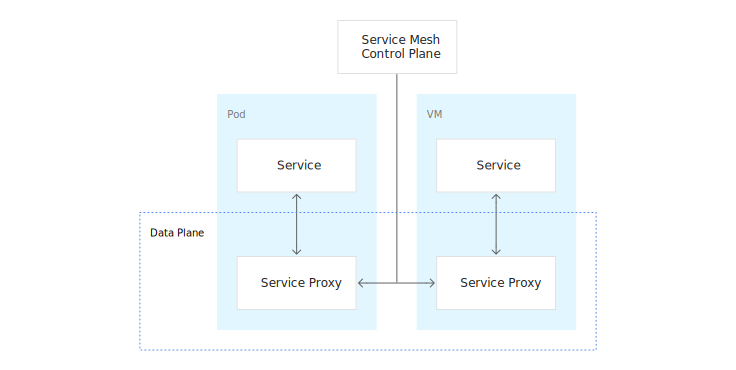
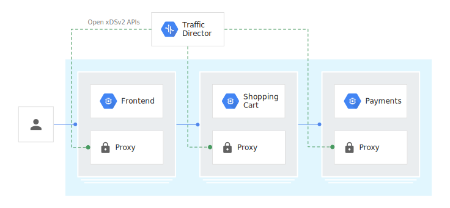
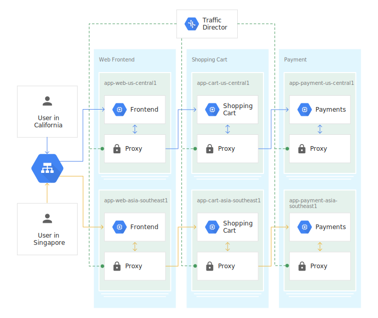
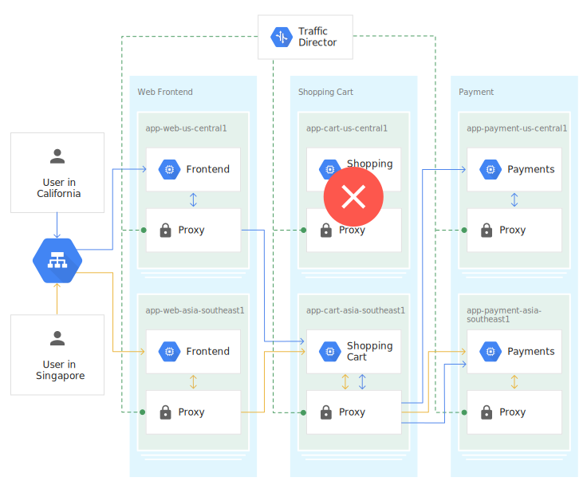

服务网格在部署微服务和其他现代应用程序时变得越来越流行。在服务网格中，数据平面使用服务代理（例如[Envoy](https://www.envoyproxy.io/)）来控制流量，而服务网格控制平面则为服务代理提供策略、配置和智能。

服务网格作为控制平面

服务网格减少了运行服务必须编写和维护的网络开发代码量。相反，服务代理会在您的业务逻辑旁边执行网络功能。需要服务控制平面来管理服务代理。

**Traffic Director** 是Google Cloud Platform完全托管的服务网格流量控制平面。使用Traffic Director，您可以轻松地跨多个区域中的集群和VM实例部署全局负载均衡，从服务代理下放运行状况检查，以及配置复杂的流量控制策略。Traffic Director使用 [开放标准API（xDS v2）](https://www.envoyproxy.io/docs/envoy/latest/api-v2/api) 与数据平面中的服务代理进行通信，确保您不会被锁定到专有解决方案，并且可以使用您选择的服务网格控制平面。

Traffic Director作为微服务环境中的控制平面

### 使用Traffic Director进行全局负载平衡

Traffic Director 通过服务代理为您的内部微服务提供[全局负载平衡](https://cloud.google.com/load-balancing/docs/load-balancing-overview)。您可以在多个区域中部署具有实例的内部微服务（基于服务代理）。Traffic Director为服务代理提供运行状况，路由和后端信息，使他们能够针对服务执行到多个云区域中的应用程序实例的最佳流量路由。

在下图中，全局负载均衡部署具有三个全局微服务：Front End，Shopping Cart 和 Payments。在托管实例上运行的每个服务分组到两个区域，`us-central1` 和 `asia-southeast1`。Traffic Director使用全局负载均衡算法，将来自加利福尼亚用户的流量定向到部署的微服务`us-central1`，而来自新加坡用户的请求则定向到微服务 `asia-southeast1`。

传入的用户请求被路由到Front End微服务。安装在具有Front End的主机上的服务代理然后将流量引导到Shopping Cart。使用Shopping Cart安装在主机上的服务代理将流量定向到Payments微服务。

全局负载平衡部署中的Traffic Director

在以下示例中，如果Traffic Director收到运行状况检查结果，指示运行购物车微服务的VM运行状况`us-central1` 不佳，则Traffic Director会指示服务代理服务器前端微服务将流量故障转移到运行的购物车微服务`asia-southeast1`。由于自动扩展与Google Cloud Platform中的流量管理集成在一起，因此Traffic Director会向托管实例组通知 `asia-southeast1`其他流量，并且托管实例组的大小会增加。

Traffic Director检测到Payments微服务的所有后端都是健康的，因此Traffic Director指示Envoy的购物车代理将一部分流量发送到客户配置的容量，`asia-southeast1`并将剩余流量 溢出到`us-central1`。

### Traffic Direcotor和Istio

[Istio](https://istio.io/) 提供了一个控制平面来保护，连接和监控微服务。它有三个组成部分：Pilot 负责流量管理，Mixer 负责可观察性，Istio Security 负责服务到服务的安全性。

Traffic Director 提供 GCP 托管的 Pilot 以及全局负载平衡和集中式运行状况检查等其他功能。但请注意，在此Beta版本中无法使用 Istio API配置Traffic Director; 您可以使用GCP API进行配置。Traffic Director和Pilot使用开放标准API（xDS v2）与服务代理进行通信。

### 限制

- Beta版本的Traffic Director仅支持GCP API。Beta版本的Traffic Director不支持Istio API。
- Traffic Director仅支持HTTP流量。
- Traffic Director流量控制功能是 Alpha 状态。
- Traffic Director支持共享VPC，不管是主机项目中的所有负载均衡资源，还是服务项目中的所有负载均衡资源。但是，只有具有至少一个使用共享VPC网络名称定义的转发规则配置的项目的服务帐户才能用于访问Traffic Director。
- Traffic Director不支持VPC 对等（peering）。
- Traffic Director Beta仅支持GCP网络中的客户端负载均衡，其名称在转发规则中指定。
- 您只能在Beta版本中使用Traffic Director配置GCP端点。我们不支持在本地或在另一个云中使用端点。
- 本文档讨论了Envoy代理，但您可以将任何 [开放标准API（xDS v2）代理](https://www.envoyproxy.io/docs/envoy/latest/api-v2/api) 与Traffic Director一起使用。但请注意，Google仅使用Envoy代理测试了Traffic Director。在此测试期间，Traffic Director仅支持Envoy版本1.9.1或更高版本。

### 参考资料

- Traffic Director官方文档 [Traffic Director concepts](https://cloud.google.com/traffic-director/docs/traffic-director-concepts)

